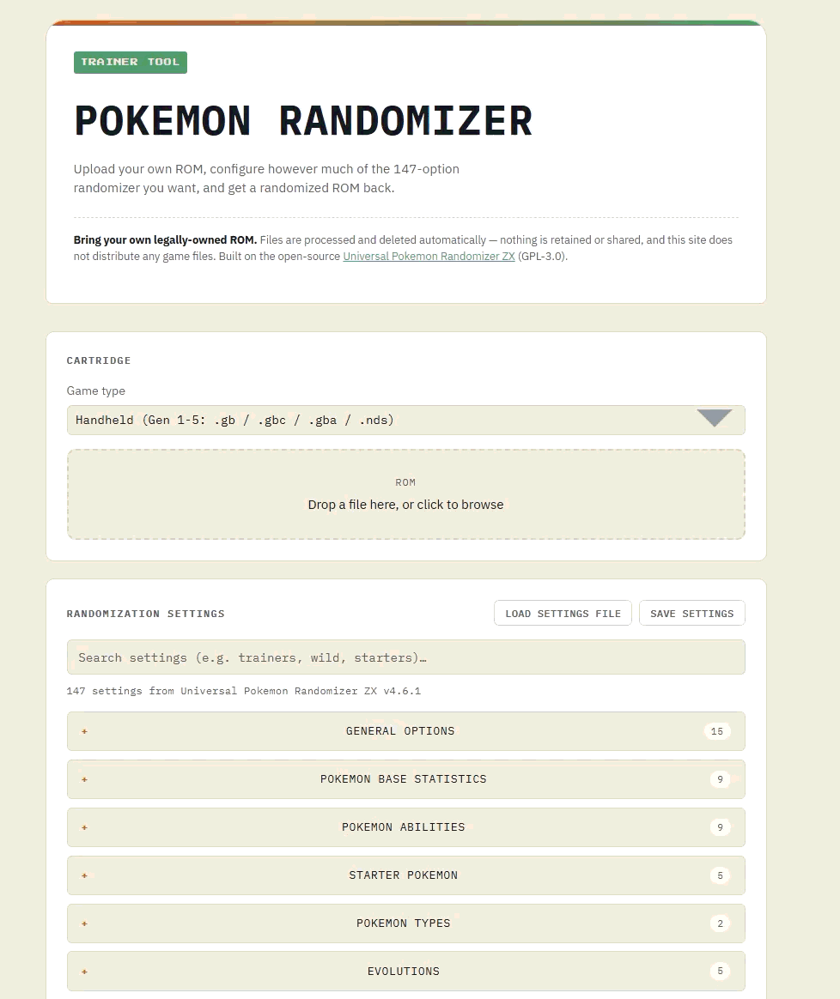

# Pokemon Randomizer Web App

A web frontend for [Universal Pokemon Randomizer ZX](https://github.com/Ajarmar/universal-pokemon-randomizer-zx)
(GPL-3.0). Upload your own legally-owned ROM, configure randomization
options, and download a randomized ROM — all generations, Gen 1 through 7
(including 3DS). You can also load an existing settings file (from this app
or the desktop app's "Make Preset") to prefill the form, and save your
current selections back out as one.



We don't fork or reimplement the randomizer. We vendor the official,
unmodified release jar and drive it through its existing headless CLI mode.
The web form's ~150 settings are extracted from the real `Settings` class
into `java-shim/settings-schema.json` (see that file's `sourceTag`), which
also drives a small Java shim (`java-shim/`) that calls the real setters to
produce the binary settings file the CLI expects — no reimplementation of
its format.

Design spec: [`docs/superpowers/specs/2026-07-20-pokemon-randomizer-webapp-design.md`](docs/superpowers/specs/2026-07-20-pokemon-randomizer-webapp-design.md).

## Setting it up

This is the free, self-hosted way to run it — on your own machine, no
subscriptions. The whole stack (web + api + worker + redis) runs in Docker
containers; you don't need Node, Java, or Redis installed on your host at
all for this path.

### 1. Install Docker Desktop

If you don't already have it:

- **Windows**: `winget install --id Docker.DockerDesktop -e`, or download
  from [docker.com](https://www.docker.com/products/docker-desktop/).
  Docker Desktop needs **WSL2**, which recent Windows 10/11 installs
  usually already have — the installer will tell you if it doesn't.
- **Mac**: `brew install --cask docker`, or download from docker.com.
- **Linux**: install `docker` and the `docker compose` plugin via your
  distro's package manager, or follow [Docker's Linux install docs](https://docs.docker.com/engine/install/).

After installing, **launch Docker Desktop once** and let it finish starting
(there's usually a first-run license/sign-in screen to click through) before
continuing.

**If you hit "Virtualization support not detected" (Windows):** your CPU
supports it, but it's switched off in your BIOS/UEFI firmware. This isn't
something Docker or Windows can fix in software — reboot, enter your
motherboard's BIOS setup (usually `Del` or `F2` at boot), and enable
**Intel VT-x** / **Intel Virtualization Technology** or **AMD SVM Mode**
(under an "Advanced" or "CPU Configuration" menu — exact wording and
location vary by motherboard). Save, exit, and Docker Desktop should start
normally.

### 2. Configure (optional)

```
cp .env.example .env
```

Defaults are sane for personal/small-scale use (24h file retention, 5
jobs/hour per IP, 2 concurrent randomization jobs). Adjust `.env` if you
want different limits — see the comments in `.env.example` for what each
one does.

### 3. Build and run

```
docker compose up --build
```

First run takes a few minutes: the `worker` image's build step downloads
the official randomizer release and a small JSON library, both pinned by
version and verified by sha256 before use (see the `ARG`s at the top of
`apps/worker/Dockerfile`) — nothing is fetched unpinned. Subsequent runs are
fast since Docker caches the build.

Once it's up, open **http://localhost:8080**. Upload a ROM you legally own,
pick your randomization settings, and download the result. To stop it:
`docker compose down` (add `-v` to also wipe the redis/job-data volumes).

### Running locally without Docker

If you'd rather not use Docker: requires Node 20+, a JDK (17 is fine), Redis
running locally, and the vendored jar + shim on disk (see
`apps/worker/Dockerfile` for exactly how those are fetched/compiled — you'd
replicate those steps by hand and point `RANDOMIZER_JAR_PATH` /
`SETTINGS_SHIM_JAR_PATH` at the results).

```
npm install
npm run build -w packages/shared
npm run dev:api      # apps/api, needs REDIS_URL
npm run dev:worker   # apps/worker, needs the vendored jar + shim
npm run dev:web      # apps/web, proxies /api to :3001
```

### Hosting it publicly for free

Docker Compose on your own machine only serves `localhost`. To make it
reachable from the internet without paying for hosting:

- **Cloudflare Tunnel**: free, gives you a public URL while it keeps
  running on your machine (`cloudflared tunnel --url http://localhost:8080`
  after a one-time `cloudflared` setup).
- **Oracle Cloud "Always Free" tier**: a real always-on VM, free
  indefinitely (not a trial) — run the same `docker compose up` there
  instead of locally.

Either way, you're now running a public service that processes other
people's ROM uploads — re-read the Legal / privacy section below and make
sure the rate limits and retention window in `.env` fit that.

### Bumping the vendored randomizer version

```
# 1. update sourceTag/URLs, re-run the extraction against the new tag
# 2. node java-shim/generate-shim.mjs
# 3. update RANDOMIZER_VERSION/RANDOMIZER_ZIP_SHA256 in apps/worker/Dockerfile
```

## Structure

```
apps/web       React + TS frontend
apps/api       Express + TS — uploads, jobs, downloads
apps/worker    BullMQ consumer — shells out to the shim + randomizer CLI
packages/shared    Shared TS types/config used by api and worker
java-shim/     SettingsBuilder.java (generated) + its generator + the schema
infra/         nginx config for the web container
docker-compose.yml
```

## Legal / privacy

- This site does not host, distribute, or catalog game ROMs. Every upload
  is user-supplied, processed, and deleted automatically after
  `JOB_RETENTION_HOURS` (default 24h) regardless of download status.
- Users must confirm they own a legal copy of the game before a job runs.
- Built on the GPL-3.0-licensed Universal Pokemon Randomizer ZX — see that
  project's [license](https://github.com/Ajarmar/universal-pokemon-randomizer-zx/blob/master/LICENSE.txt).

## Testing

- `java-shim`: `java-shim/test/com/pkrandomizerweb/RoundTripCheck.java` reads
  a `.rnqs` file back via the real `Settings.read()` and prints the fields —
  the main correctness check for the schema/shim mapping, no ROM required.
  Manually verified end-to-end against the vendored v4.6.1 jar (booleans,
  plain enums, one-hot varargs enums, the GenRestrictions bitmask, and the
  MiscTweaks bitmask all round-tripped correctly). Not yet wired into an
  automated CI run — see follow-ups below.
- `api`/`worker`: unit tests with the Java subprocess mocked.
- **True end-to-end randomization is not run in CI** — we cannot ship
  copyrighted ROM fixtures. Verify manually against your own legally-owned
  ROM before each release.

## Known follow-ups

- Per-field default values: the schema captures each field's *type*, but
  not Settings' own default value for fields the user never touches — the
  shim currently falls back to a type-appropriate zero value (`false` / `0`
  / first enum constant). Extracting real defaults from `Settings.java`'s
  field initializers would make untouched fields match the desktop GUI's
  defaults exactly.
- Misc tweak display names/tooltips live in a `.properties` resource bundle
  not yet fetched — the frontend currently shows raw enum constant names
  (e.g. `BW_EXP_PATCH`) instead of friendly labels.
- A few fields' GUI tab grouping is best-effort (noted individually in
  `settings-schema.json`, e.g. `evosAllowAltFormes`,
  `limitMainGameLegendaries`) — verify against the live desktop GUI if exact
  tab placement matters.
- The round-trip check (see Testing above) isn't wired into an automated
  test runner/CI yet — currently a manual `javac`/`java` invocation.
- Rate limiting is in-memory (single API instance only) — swap for a
  Redis-backed store before running multiple API replicas.
- `vite`/`vitest` dev-dependencies currently carry known advisories
  (path traversal in `vite dev`'s optimized-deps handling, an arbitrary
  file read in vitest's UI server) — both are dev-tooling-only, not shipped
  in the production build, but worth bumping past when a non-major fix
  lands upstream.
- No automated tests written yet for `api`/`worker`/`web` beyond the manual
  build/typecheck/shim verification done during initial scaffolding.
